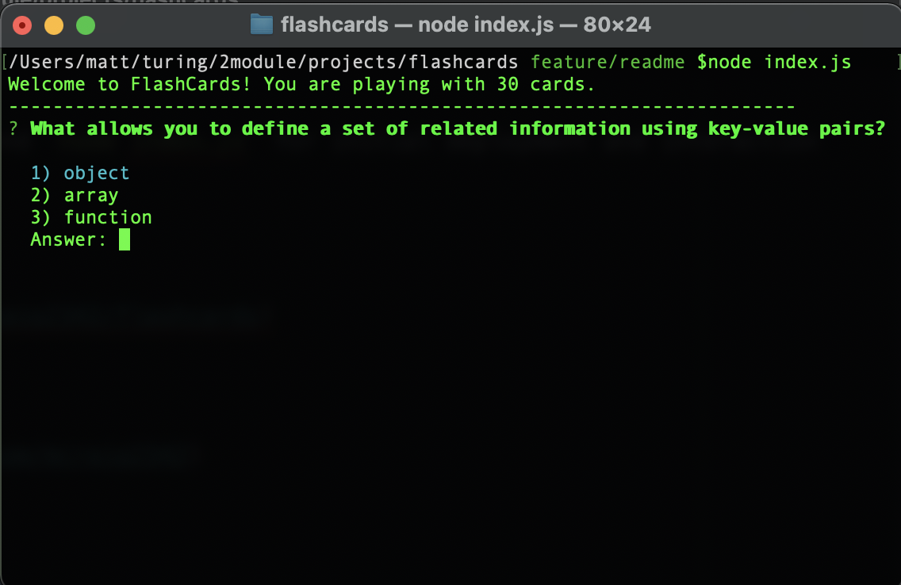
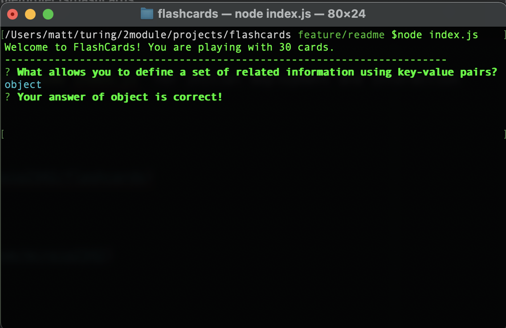

# Flashcards

#### A set of virtual flash cards to test your javascript knowledge!

## Overview

* Flashcards is a set of 30 virtual flashcards that will quiz you on your javascript
knowledge directly in your console. Each card has 3 multiple choice answers that you
can select with your arrow keys in the console. When you make a guess, you will receive
feedback on your answer. When all 30 questions have been answered, the round is over
and you will see the percent of questions you answered correctly!

## Set-up

* Create a repository and clone it to your local computer
* Open it in your text editor
* Read the `README.md`
* In the terminal run the command `node index.js` for initial deployment and interaction with app

## Project Links

* [Repo](https://github.com/mcraig2342/flashcards)

## Contributors

* [Matt Craig](https://github.com/mcraig2342)

## Road Map

##### Future Iterations Should Include:

* A new set of cards to play a second round with.
* A timer to show how long you took to finish the round.
* Additional functionality so if a user gets less than 90% correct, they repeat
the round.

## Preview

Initialize Game 
 

Answer Feedback 
 

Round Over 
 

